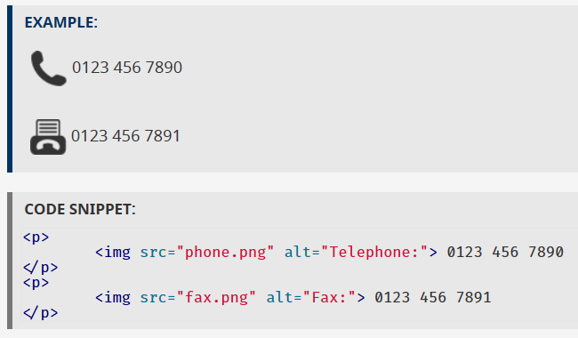

## ⚡ Image Alt Text 101 ⚡

**Ed Rivas**

<small>@je92rivas | ed@unplug.studio</small>

---

# 💡 Concepts

-

## 🎬 Functional Images

- Initiate actions
- Used in interactive elements
- Icons, badges

-

## 💁🏻‍ Informative Images

- Graphically represent concepts and information
- Pictures, photos, illustrations

-

## 💅🏻 Decorative Images

- Only add visual decoration
- Do NOT convey information
- Background images, borders, artsy things

---

# 🧭 Guide

-

- Focus on describing FUNCTION or CONTENT
- All images must have an alt attribute (even if empty)
- Context is key when describing images

-

## (1) Is this image interactive?

- It's a *functional* image
- Describe the action or result

-

-

-

## (2) Does this image include content?

- It's an *informative* image
- Describe the meaning and purpose
- Avoid literal descriptions
- No need to start with "Picture..." or "Photo..."
- Surrounding context might be enough

-

-

-

-

## (3) No function and no content?

- It's is a *decorative* image
- Don't provide alt text: ``
- Screen readers will skip completely

-

-

-

---

# ✨ Extras

- Images of text (please don't)
- Complex images (charts, graphs)
- Groups of images (star ratings, other widgets)
- Image maps

-

- https://www.w3.org/WAI/tutorials/images/
- https://webaim.org/techniques/alttext/

-

## Need help with accessibility?

**Ed Rivas**

<small>@je92rivas | ed@unplug.studio</small>
